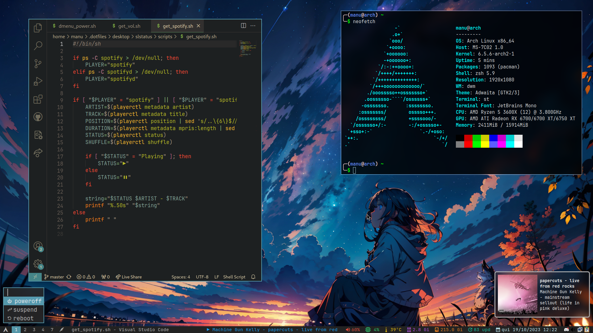

# welcome to my dotfiles
here you can find my poor attempts at ricing dwm, like this one:

# Credit to all creators and contributors of the following software:

- [dwm-flexipatch](https://github.com/bakkeby/dwm-flexipatch)
- [st-flexipatch](https://github.com/bakkeby/st-flexipatch)
- [dmenu-flexipatch](https://github.com/bakkeby/dmenu-flexipatch)
- [slstatus](https://tools.suckless.org/slstatus/) (bar that I'm currently using)
- [dwm-bar](https://github.com/joestandring/dwm-bar) (not currently using but very good)
- [dunst](https://github.com/dunst-project/dunst)
- [maim](https://github.com/naelstrof/maim)
- [neovim config](https://www.youtube.com/watch?v=w7i4amO_zaE)
- [bpytop](https://github.com/aristocratos/bpytop)
